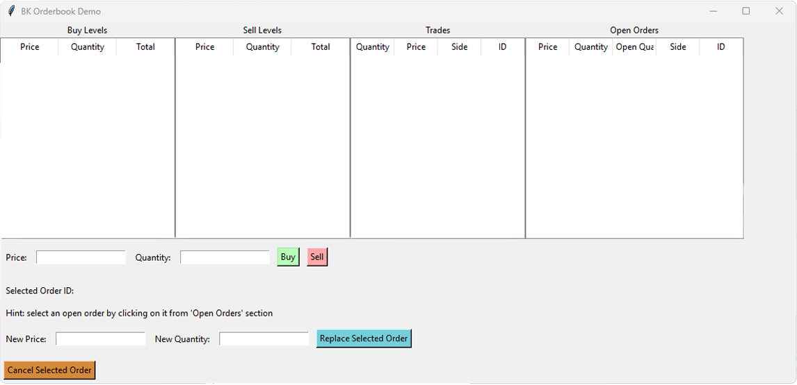
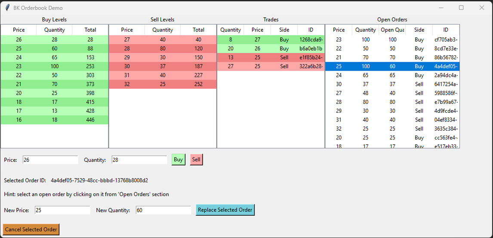
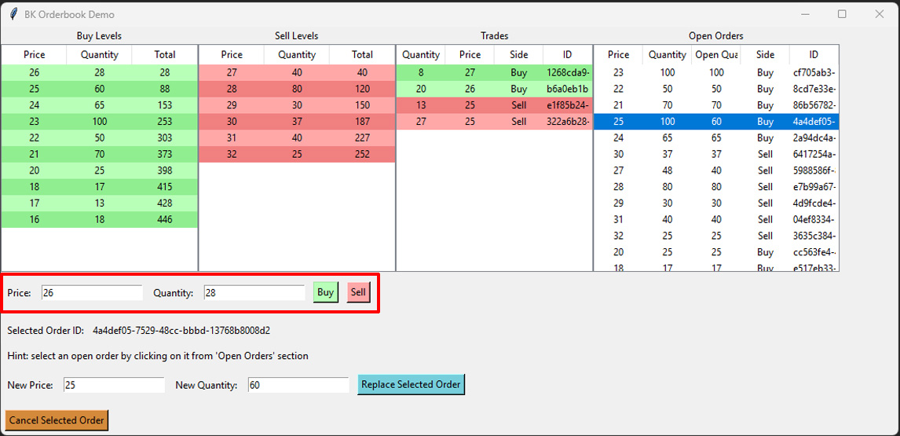
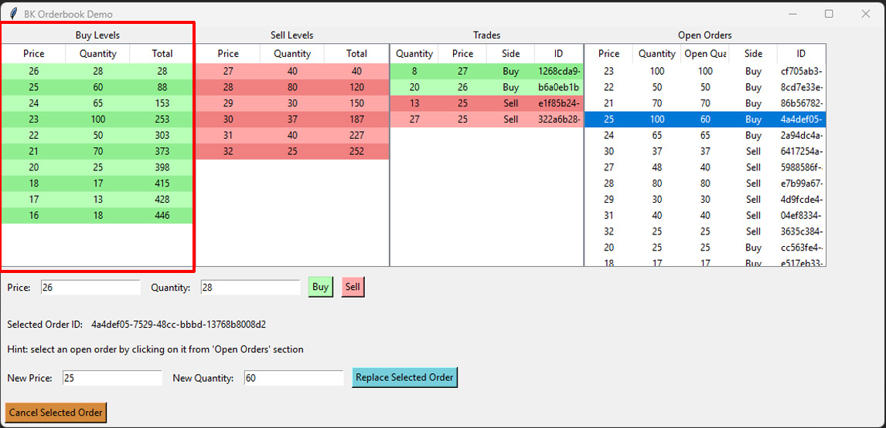
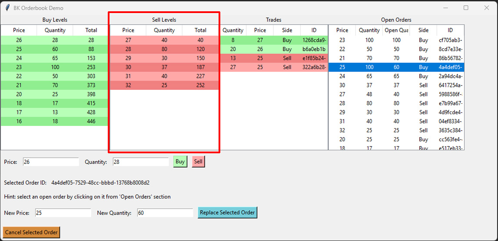
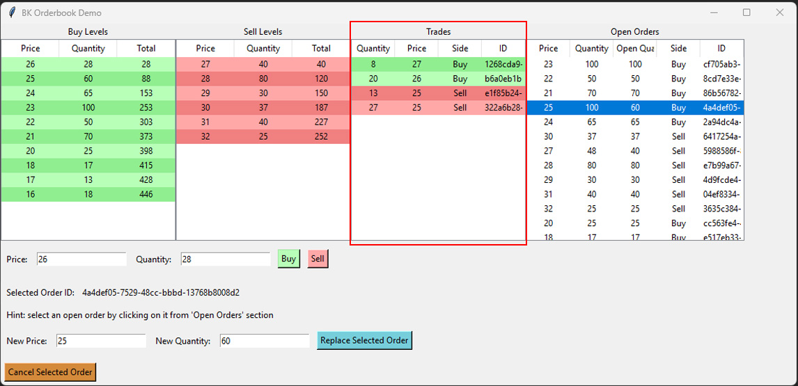
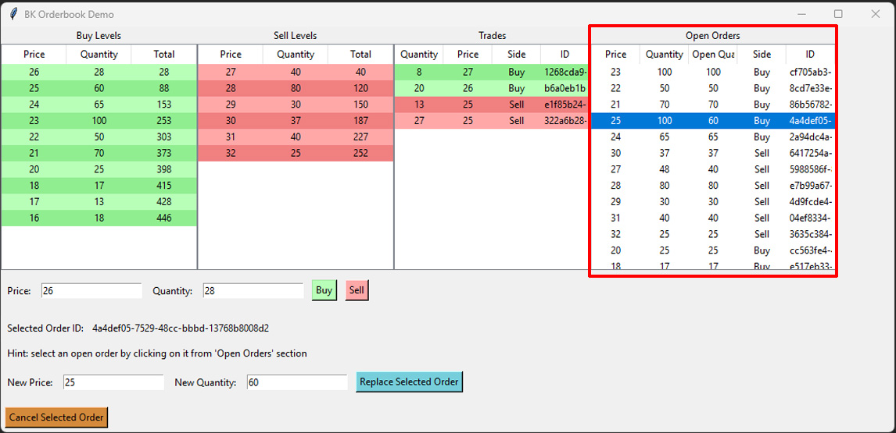
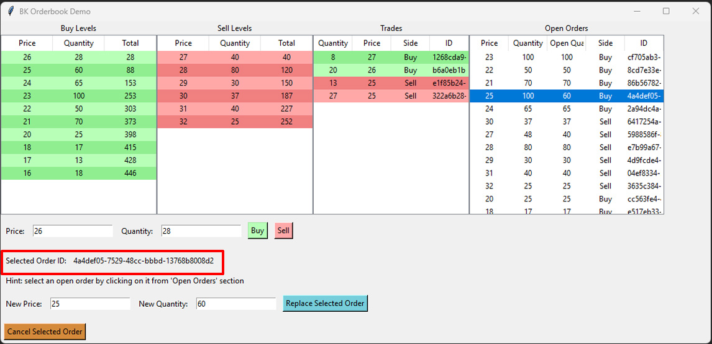
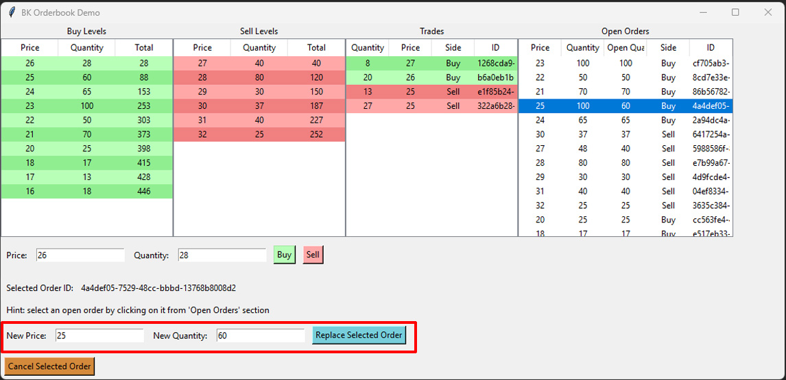
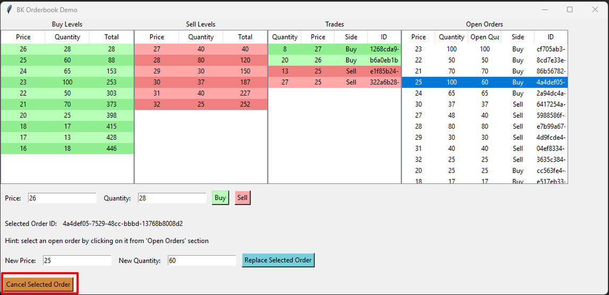

# Matching Engine

## Overview

This matching engine is designed for efficient order matching in financial markets. It utilizes a combination of data structures to optimize matching performance and manage price levels and orders. The order book is represented using **Red-Black Trees** as key-value pairs for each side (buy and sell), where the values are **doubly linked lists** combined with **hash maps** for fast cancellation and replacement after finding the price level.

### Features


- **Red-Black Tree for Price Levels:** The engine uses a red-black tree to store and balance price levels, providing efficient searching, insertion, and deletion operations in O(logN) time where N is the count of price levels for one side(buy or sell) on the orderbook.
- **Doubly Linked List with Hash Map for Orders:** Orders at each price level are stored in a doubly linked list to maintain order of execution, while a hash map allows quick lookups for individual orders for replaces and cancels.
- **Efficient Matching:** The engine supports both limit and market orders with quick matching algorithms.
- **Scalable and Fast:** Designed to handle high-frequency trading environments with fast order matching.

## Installation

### Prerequisites

- **[Python 3.13.1+](https://www.python.org/downloads/)**
### Installation Steps

1. Clone the repository:
   ```bash
   git clone https://github.com/barkin-kaplan/python-matching-engine/
   ```
   ```bash
   cd python-matching-engine
2. Create a virtual environment(Optional)
   ```bash
   path/to/your/pyton -m venv .venv
3. Activate virtual environment(Skip if you skipped step 2)

   Windows
   ```bash
   .venv\Scripts\activate
   ```
   Macos
   ```bash
   source .venv/bin/activate
   
5. Install python dependencies
   ```bash
   pip install -r requirements.txt
6. Run orderbookgui.py for UI demo
   ```bash
   python orderbook_gui.py
7. Run performance tests
   ```bash
   python orderbook_perf_test.py
   
### Running Unit Tests
You can run unit tests locally with
```bash
pytest
```
Generate coverage reports
   1. only line coverage
      ```bash
        pytest --cov --cov-report=html
   3. line and branch coverage
      ```bash
        pytest --cov --cov-branch --cov-report=html
# Performance Metrics
Firstly running times will be higher than actual repoted execution times because for each test a fresh orderbook is populated beforehand and that takes extra time.
Here are the performance result on my machine. I'm running on a AMD Ryzen 9 7900X3D 12-Core Processor. 
In short using red black tree gives advantage of increasing complexity by O(logN) when number of price levels increase while order count is constant. Using doubly linked list with has map has constant time for insertion and deletion therefore complexity increases linearly when order count increases for same price level count. 

Notice how execution times remain similar when price range is bigger than actual order count, this is naturally normal because price levels are created with order insertions. So the count of price levels are bounded by the number of inserted orders even if the orders' prices are rolled from a bigger range.

## Insert Operations
- **Small (count: 1000)**
  - Small price range ([1, 1000]): `0.009226 seconds`
  - Medium price range ([1, 10000]): `0.008031 seconds`
  - Large price range ([1, 100000]): `0.008414 seconds`
- **Medium (count: 10000)**
  - Small price range ([1, 1000]): `0.109 seconds`
  - Medium price range ([1, 10000]): `0.1779 seconds`
  - Large price range ([1, 100000]): `0.1863 seconds`
- **Large (count: 100000)**
  - Small price range ([1, 1000]): `1.2399 seconds`
  - Medium price range ([1, 10000]): `4.6751 seconds`
  - Large price range ([1, 100000]): `12.09 seconds`

## Replace Operations
- **Small (count: 1000)**
  - For small order count (1000):
    - Small price range ([1, 1000]): `0.005272 seconds`
    - Medium price range ([1, 10000]): `0.007436 seconds`
    - Large price range ([1, 100000]): `0.008165 seconds`
  - For medium order count (10000):
    - Small price range ([1, 1000]): `0.005253 seconds`
    - Medium price range ([1, 10000]): `0.00765 seconds`
    - Large price range ([1, 100000]): `0.01056 seconds`
  - For large order count (100000):
    - Small price range ([1, 1000]): `0.005989 seconds`
    - Medium price range ([1, 10000]): `0.007017 seconds`
    - Large price range ([1, 100000]): `0.008223 seconds`
- **Medium (count: 10000)**
  - For small order count (1000):
    - Small price range ([1, 1000]): `0.03234 seconds`
    - Medium price range ([1, 10000]): `0.04268 seconds`
    - Large price range ([1, 100000]): `0.05129 seconds`
  - For medium order count (10000):
    - Small price range ([1, 1000]): `0.04883 seconds`
    - Medium price range ([1, 10000]): `0.2235 seconds`
    - Large price range ([1, 100000]): `0.3828 seconds`
  - For large order count (100000):
    - Small price range ([1, 1000]): `0.05782 seconds`
    - Medium price range ([1, 10000]): `0.069 seconds`
    - Large price range ([1, 100000]): `0.3082 seconds`
- **Large (count: 100000)**
  - For small order count (1000):
    - Small price range ([1, 1000]): `0.1047 seconds`
    - Medium price range ([1, 10000]): `0.1271 seconds`
    - Large price range ([1, 100000]): `0.1359 seconds`
  - For medium order count (10000):
    - Small price range ([1, 1000]): `0.2602 seconds`
    - Medium price range ([1, 10000]): `1.8403 seconds`
    - Large price range ([1, 100000]): `2.9579 seconds`
  - For large order count (100000):
    - Small price range ([1, 1000]): `0.5136 seconds`
    - Medium price range ([1, 10000]): `0.9424 seconds`
    - Large price range ([1, 100000]): `27.642 seconds`

## Cancel Operations
- **Small (count: 1000)**
  - For small order count (1000):
    - Small price range ([1, 1000]): `0.0009525 seconds`
    - Medium price range ([1, 10000]): `0.001044 seconds`
    - Large price range ([1, 100000]): `0.001013 seconds`
  - For medium order count (10000):
    - Small price range ([1, 1000]): `0.001176 seconds`
    - Medium price range ([1, 10000]): `0.001335 seconds`
    - Large price range ([1, 100000]): `0.001382 seconds`
  - For large order count (100000):
    - Small price range ([1, 1000]): `0.001738 seconds`
    - Medium price range ([1, 10000]): `0.00224 seconds`
    - Large price range ([1, 100000]): `0.002723 seconds`
- **Medium (count: 10000)**
  - For small order count (1000):
    - Small price range ([1, 1000]): `0.008687 seconds`
    - Medium price range ([1, 10000]): `0.009154 seconds`
    - Large price range ([1, 100000]): `0.008973 seconds`
  - For medium order count (10000):
    - Small price range ([1, 1000]): `0.01119 seconds`
    - Medium price range ([1, 10000]): `0.01378 seconds`
    - Large price range ([1, 100000]): `0.01439 seconds`
  - For large order count (100000):
    - Small price range ([1, 1000]): `0.01633 seconds`
    - Medium price range ([1, 10000]): `0.0207 seconds`
    - Large price range ([1, 100000]): `0.02565 seconds`
- **Large (count: 100000)**
  - For small order count (1000):
    - Small price range ([1, 1000]): `0.08268 seconds`
    - Medium price range ([1, 10000]): `0.08782 seconds`
    - Large price range ([1, 100000]): `0.08765 seconds`
  - For medium order count (10000):
    - Small price range ([1, 1000]): `0.09444 seconds`
    - Medium price range ([1, 10000]): `0.1191 seconds`
    - Large price range ([1, 100000]): `0.1253 seconds`
  - For large order count (100000):
    - Small price range ([1, 1000]): `0.1498 seconds`
    - Medium price range ([1, 10000]): `0.1867 seconds`
    - Large price range ([1, 100000]): `0.2357 seconds`

# (G)raphical (U)ser (I)nterface Demonstration
This interface is developed to demonstrate working mechanisms of this matching engine implementation. Below you can see empty and populated versions of this GUI. Sub sections will introduce you to parts of this GUI.
### Empty Screenshot

### Populated Screenshot


### Order Entry
You can enter the price and quantity information in the related input fields and click 'Buy' if you want to send a buy order to orderbook or click 'Sell' if you want to send a sell order to orderbook.


### Buy Levels
Unmatched buy orders are shown here. Since higher price has higher priority on the buy side, price levels are in reverse sorted order when going down the table.


### Sell Levels
Unmatched sell orders are shown here. Since lower price has higher priority on the sell side, price levels are in sorted order when going down the table.


### Trades
In this section actual trades are shown. Latest trade is inserted at the top. The side of the trade is determined buy the active order's side meaning that if the trade occurred at the time of buy order insertion then trade's side is 'Buy', 
similarly if the trade occurred ath the time of sell order insertion then the trade's side is 'Sell'.



### Open Orders
In this section you can view open orders. Notice how 'Buy Levels' and 'Sell Levels' sections aggregate open orders' open quantities at the same level.
You can select open orders from here in order to 'Replace' or 'Cancel' them.



### Selected Order ID
When you select an order selected order id text will reflect this information.



### Replace Form
You can change an order's price and quantity using this form. If you want to change only the price or the quantity, simply leave the other unchanged. Quantity inserted here will be the remaining open quantity after order's trades, not the addition of reamining open quantity and filled quantity.



### Cancel Button
You can cancel the selected order with this button.



